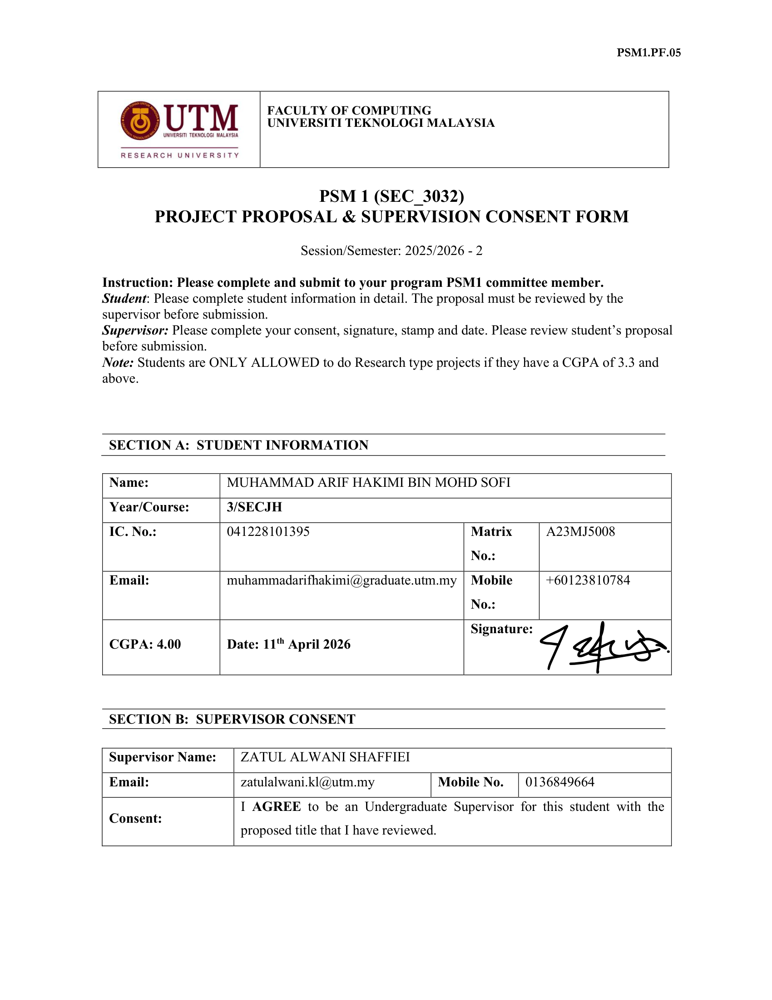
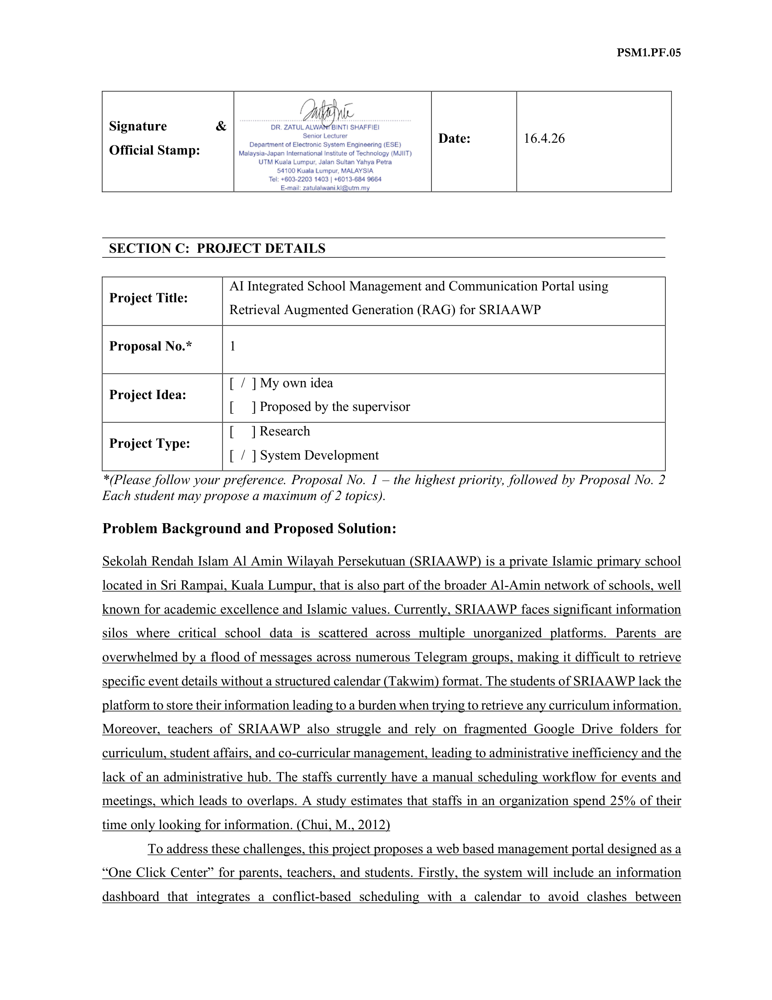
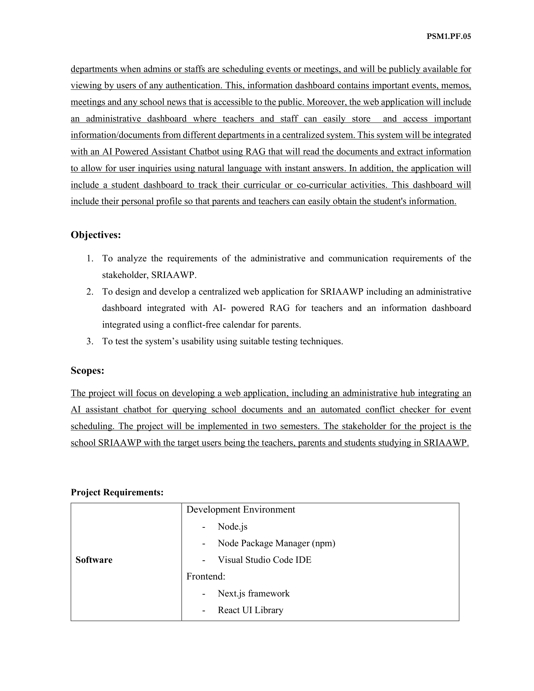
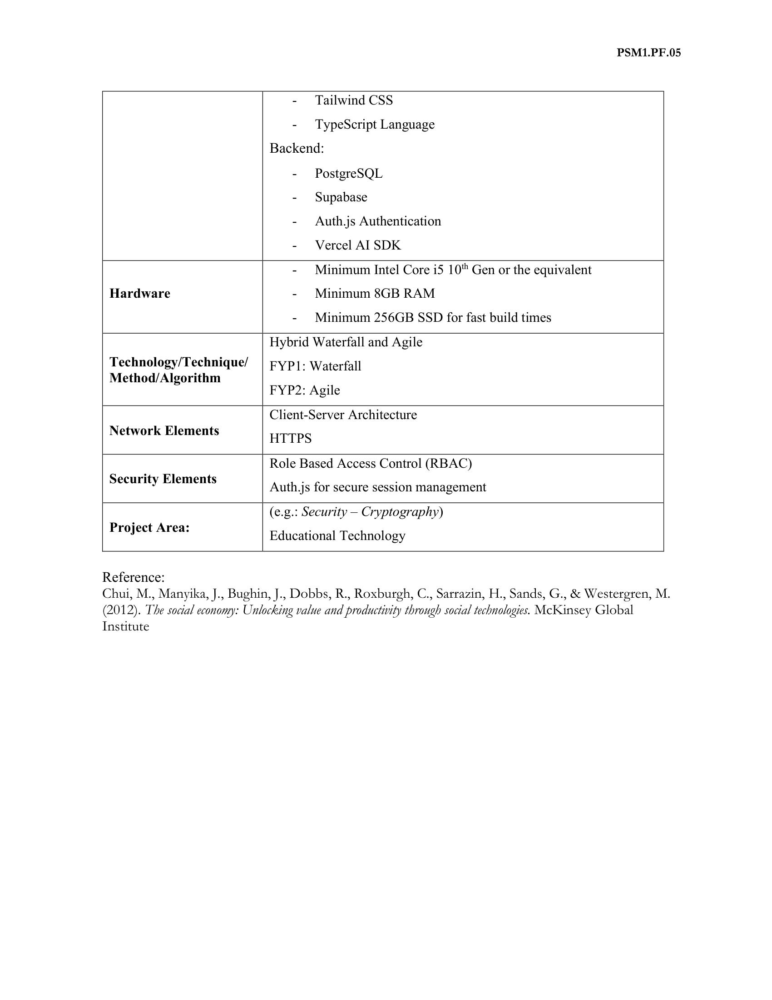

# Project Proposal & Supervision Consent Form (PP)

> Source: `docs/PP_MUHAMMAD ARIF HAKIMI BIN MOHD SOFI_A23MJ5008.pdf`
> Form code: PSM1.PF.05 — Faculty of Computing, Universiti Teknologi Malaysia
> Session/Semester: 2025/2026 - 2

---

## Page 1

**PSM 1 (SEC_3032) — PROJECT PROPOSAL & SUPERVISION CONSENT FORM**

Instruction: Please complete and submit to your program PSM1 committee member.

- **Student**: Please complete student information in detail. The proposal must be reviewed by the supervisor before submission.
- **Supervisor**: Please complete your consent, signature, stamp and date. Please review student's proposal before submission.
- **Note**: Students are ONLY ALLOWED to do Research type projects if they have a CGPA of 3.3 and above.

### Section A: Student Information

| Field | Value |
|---|---|
| Name | MUHAMMAD ARIF HAKIMI BIN MOHD SOFI |
| Year/Course | 3 / SECJH |
| IC. No. | 041228101395 |
| Matrix No. | A23MJ5008 |
| Email | muhammadarifhakimi@graduate.utm.my |
| Mobile No. | +60123810784 |
| CGPA | 4.00 |
| Date | 11th April 2026 |
| Signature | (signed) |

### Section B: Supervisor Consent

| Field | Value |
|---|---|
| Supervisor Name | ZATUL ALWANI SHAFFIEI |
| Email | zatulalwani.kl@utm.my |
| Mobile No. | 0136849664 |
| Consent | I AGREE to be an Undergraduate Supervisor for this student with the proposed title that I have reviewed. |

---

## Page 2

**Supervisor signature & official stamp**

> DR. ZATUL ALWANI BINTI SHAFFIEI
> Senior Lecturer
> Department of Electronic System Engineering (ESE)
> Malaysia-Japan International Institute of Technology (MJIIT)
> UTM Kuala Lumpur, Jalan Sultan Yahya Petra
> 54100 Kuala Lumpur, MALAYSIA
> Tel: +603-2203 1403 | +6013-684 9664
> E-mail: zatulalwani.kl@utm.my
>
> Date: **16.4.26**

### Section C: Project Details

| Field | Value |
|---|---|
| Project Title | AI Integrated School Management and Communication Portal using Retrieval Augmented Generation (RAG) for SRIAAWP |
| Proposal No. | 1 (highest priority) |
| Project Idea | [x] My own idea  /  [ ] Proposed by the supervisor |
| Project Type | [ ] Research  /  [x] System Development |

> *Each student may propose a maximum of 2 topics.*

### Problem Background and Proposed Solution

Sekolah Rendah Islam Al Amin Wilayah Persekutuan (SRIAAWP) is a private Islamic primary school located in Sri Rampai, Kuala Lumpur, that is also part of the broader Al-Amin network of schools, well known for academic excellence and Islamic values. Currently, SRIAAWP faces significant **information silos** where critical school data is scattered across multiple unorganized platforms. Parents are overwhelmed by a flood of messages across numerous Telegram groups, making it difficult to retrieve specific event details without a structured calendar (Takwim) format. The students of SRIAAWP lack the platform to store their information leading to a burden when trying to retrieve any curriculum information. Moreover, teachers of SRIAAWP also struggle and rely on fragmented Google Drive folders for curriculum, student affairs, and co-curricular management, leading to administrative inefficiency and the lack of an administrative hub. The staffs currently have a manual scheduling workflow for events and meetings, which leads to overlaps. A study estimates that staffs in an organization spend 25% of their time only looking for information. (Chui, M., 2012)

---

## Page 3

(continued)

To address these challenges, this project proposes a **web based management portal** designed as a "One Click Center" for parents, teachers, and students.

- The system will include an **information dashboard** that integrates a conflict-based scheduling with a calendar to avoid clashes between departments when admins or staffs are scheduling events or meetings, and will be publicly available for viewing by users of any authentication. This information dashboard contains important events, memos, meetings and any school news that is accessible to the public.
- The web application will include an **administrative dashboard** where teachers and staff can easily store and access important information/documents from different departments in a centralized system. This system will be integrated with an **AI Powered Assistant Chatbot using RAG** that will read the documents and extract information to allow for user inquiries using natural language with instant answers.
- The application will include a **student dashboard** to track their curricular or co-curricular activities. This dashboard will include their personal profile so that parents and teachers can easily obtain the student's information.

### Objectives

1. To analyze the requirements of the administrative and communication requirements of the stakeholder, SRIAAWP.
2. To design and develop a centralized web application for SRIAAWP including an administrative dashboard integrated with AI-powered RAG for teachers and an information dashboard integrated using a conflict-free calendar for parents.
3. To test the system's usability using suitable testing techniques.

### Scopes

The project will focus on developing a web application, including an administrative hub integrating an AI assistant chatbot for querying school documents and an automated conflict checker for event scheduling. The project will be implemented in **two semesters**. The stakeholder for the project is the school SRIAAWP with the target users being the **teachers, parents and students** studying in SRIAAWP.

### Project Requirements (start)

**Software — Development Environment**

- Node.js
- Node Package Manager (npm)
- Visual Studio Code IDE

**Software — Frontend**

- Next.js framework
- React UI Library

---

## Page 4

### Project Requirements (continued)

**Software — Frontend (cont.)**

- Tailwind CSS
- TypeScript Language

**Software — Backend**

- PostgreSQL
- Supabase
- Auth.js Authentication
- Vercel AI SDK

**Hardware**

- Minimum Intel Core i5 10th Gen or the equivalent
- Minimum 8GB RAM
- Minimum 256GB SSD for fast build times

| Field | Value |
|---|---|
| Technology / Technique / Method / Algorithm | Hybrid Waterfall and Agile — **FYP1: Waterfall**, **FYP2: Agile** |
| Network Elements | Client-Server Architecture, HTTPS |
| Security Elements | Role Based Access Control (RBAC), Auth.js for secure session management |
| Project Area | Educational Technology |

### Reference

> Chui, M., Manyika, J., Bughin, J., Dobbs, R., Roxburgh, C., Sarrazin, H., Sands, G., & Westergren, M. (2012). *The social economy: Unlocking value and productivity through social technologies.* McKinsey Global Institute.
