# Project Proposal Slide Deck (PS)

> Source: `docs/PS_MUHAMMAD ARIF HAKIMI BIN MOHD SOFI_A23MJ5008(updated).pdf`
> Title: AI Integrated School Management and Communication Portal using Retrieval Augmented Generation (RAG) for SRIAAWP
> Author: Muhammad Arif Hakimi bin Mohd Sofi
> Supervisor: Dr Zatul Alwani Binti Shaffiei

---

## Slide 1 — Title

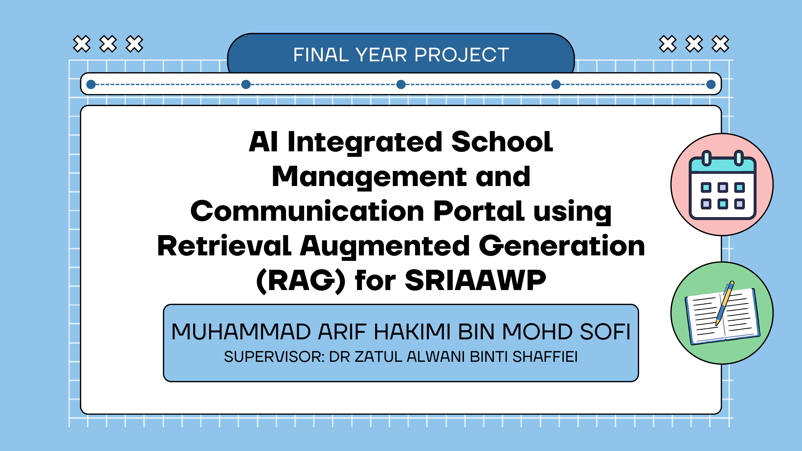

**FINAL YEAR PROJECT**

AI Integrated School Management and Communication Portal using Retrieval Augmented Generation (RAG) for SRIAAWP

Muhammad Arif Hakimi bin Mohd Sofi
Supervisor: Dr Zatul Alwani Binti Shaffiei

---

## Slide 2 — Contents

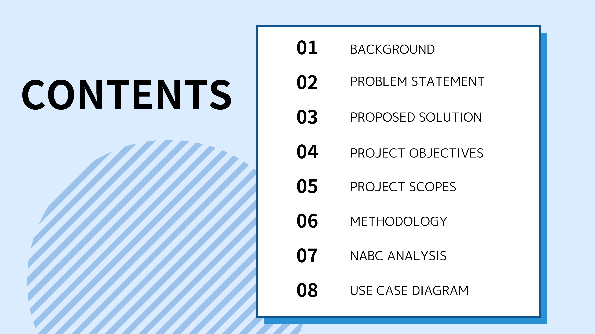

1. Background
2. Problem Statement
3. Proposed Solution
4. Project Objectives
5. Project Scopes
6. Methodology
7. NABC Analysis
8. Use Case Diagram

---

## Slide 3 — Section: 01 Background

(Section divider)

---

## Slide 4 — Sekolah Rendah Islam Al-Amin

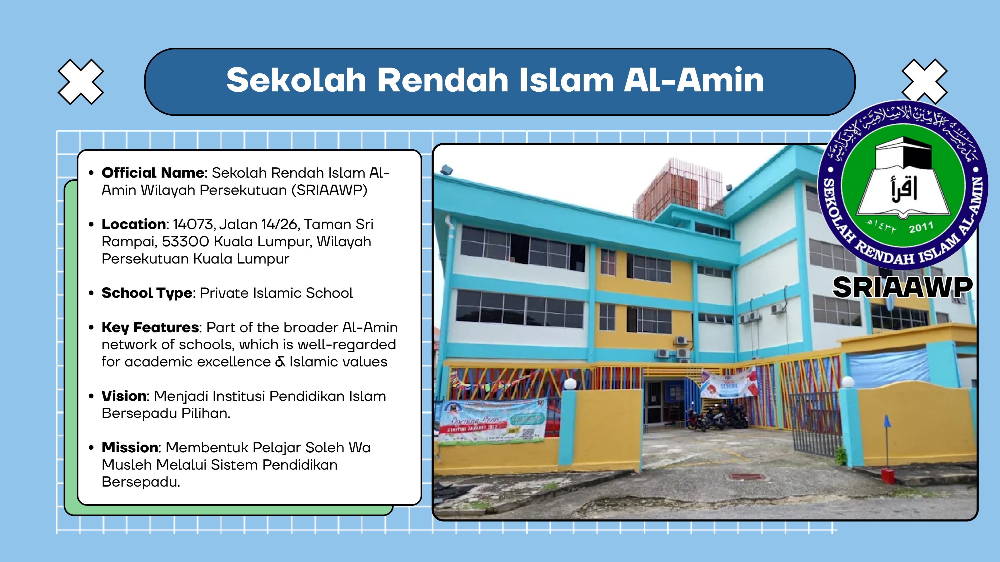

- **Official Name**: Sekolah Rendah Islam Al-Amin Wilayah Persekutuan (SRIAAWP)
- **Location**: 14073, Jalan 14/26, Taman Sri Rampai, 53300 Kuala Lumpur, Wilayah Persekutuan Kuala Lumpur
- **School Type**: Private Islamic School
- **Key Features**: Part of the broader Al-Amin network of schools, well-regarded for academic excellence & Islamic values
- **Vision**: *Menjadi Institusi Pendidikan Islam Bersepadu Pilihan.*
- **Mission**: *Membentuk Pelajar Soleh Wa Musleh Melalui Sistem Pendidikan Bersepadu.*

---

## Slide 5 — Section: 02 Problem Statement

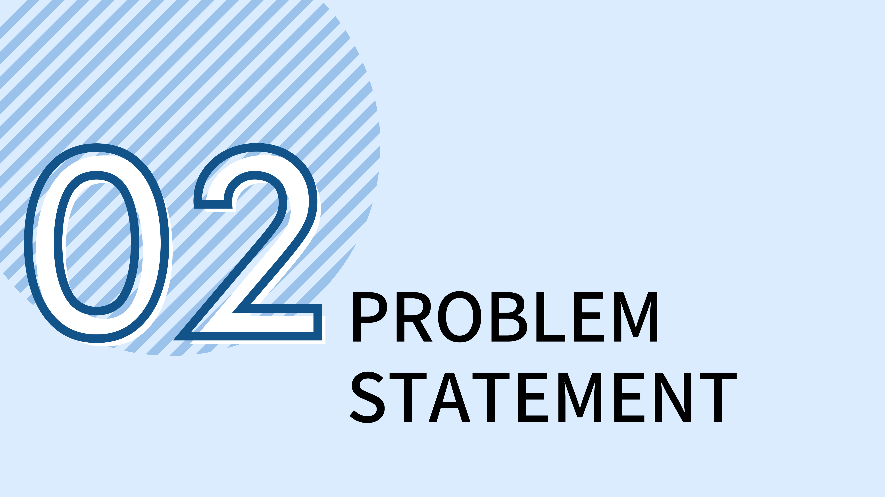

(Section divider)

---

## Slide 6 — Problem (1/2)

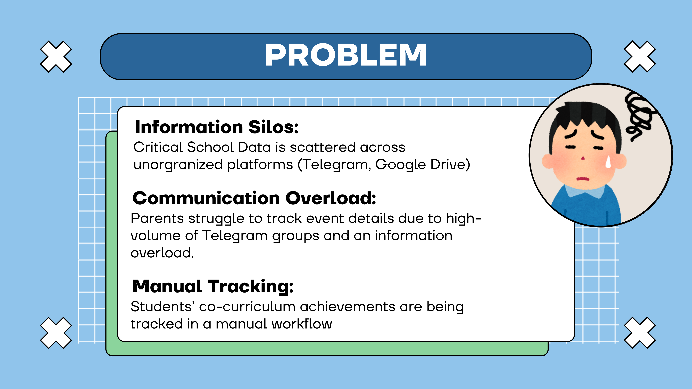

**Information Silos**
Critical school data is scattered across unorganized platforms (Telegram, Google Drive).

**Communication Overload**
Parents struggle to track event details due to high-volume Telegram groups and an information overload.

**Manual Tracking**
Students' co-curriculum achievements are tracked in a manual workflow.

---

## Slide 7 — Problem (2/2)

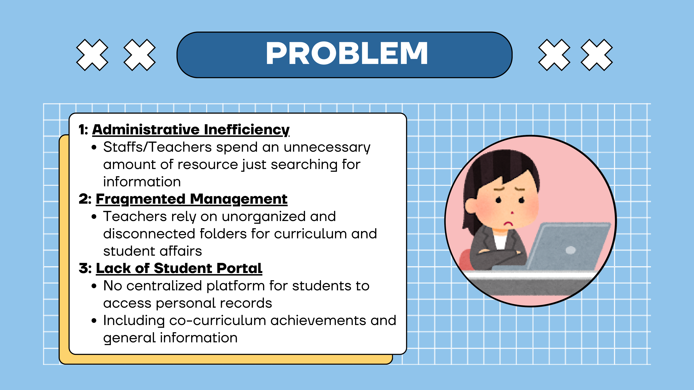

1. **Administrative Inefficiency** — Staff/teachers spend an unnecessary amount of resource just searching for information.
2. **Fragmented Management** — Teachers rely on unorganized and disconnected folders for curriculum and student affairs.
3. **Lack of Student Portal** — No centralized platform for students to access personal records, including co-curriculum achievements and general information.

---

## Slide 8 — Section: 03 Proposed Solution

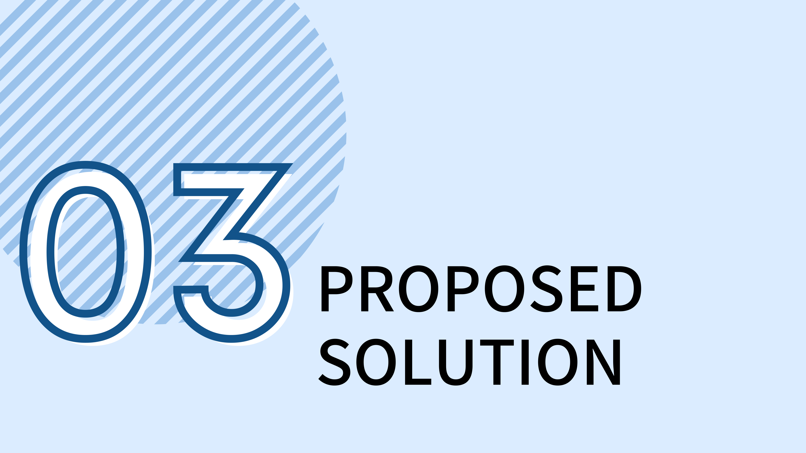

(Section divider)

---

## Slide 9 — SRIAAWP Portal Overview

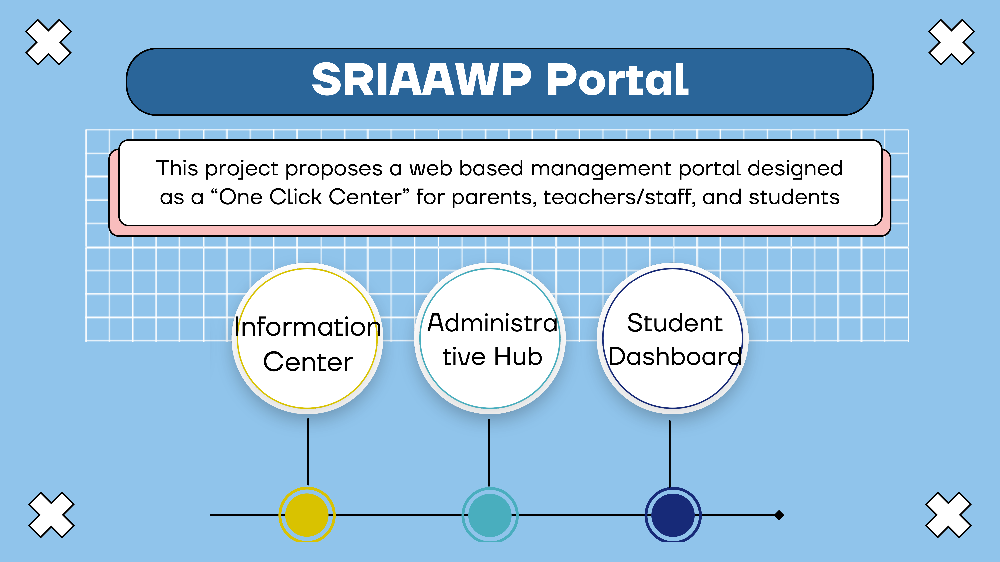

This project proposes a **web based management portal** designed as a "One Click Center" for parents, teachers/staff, and students.

Three pillars:

1. Information Center
2. Administrative Hub
3. Student Dashboard

---

## Slide 10 — Solution 1: Information Center

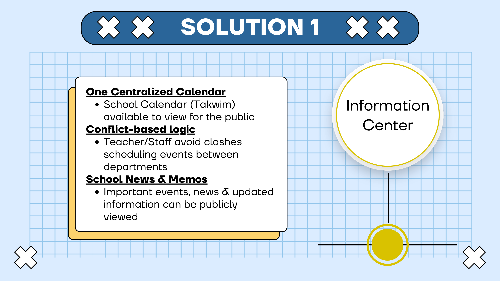

- **One Centralized Calendar** — School Calendar (Takwim) available to view for the public.
- **Conflict-based logic** — Teacher/staff avoid clashes scheduling events between departments.
- **School News & Memos** — Important events, news & updated information can be publicly viewed.

---

## Slide 11 — Solution 2: Administrative Hub

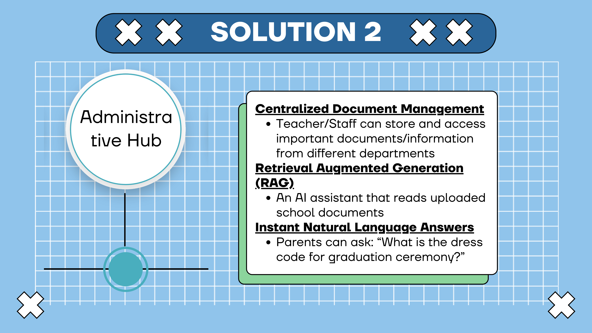

- **Centralized Document Management** — Teacher/staff can store and access important documents/information from different departments.
- **Retrieval Augmented Generation (RAG)** — An AI assistant that reads uploaded school documents.
- **Instant Natural Language Answers** — Parents can ask: *"What is the dress code for graduation ceremony?"*

---

## Slide 12 — Solution 3: Student Dashboard

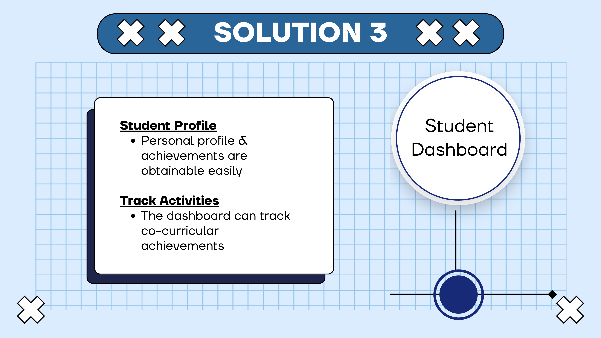

- **Student Profile** — Personal profile & achievements are obtainable easily.
- **Track Activities** — The dashboard can track co-curricular achievements.

---

## Slide 13 — Section: 04 Project Objectives

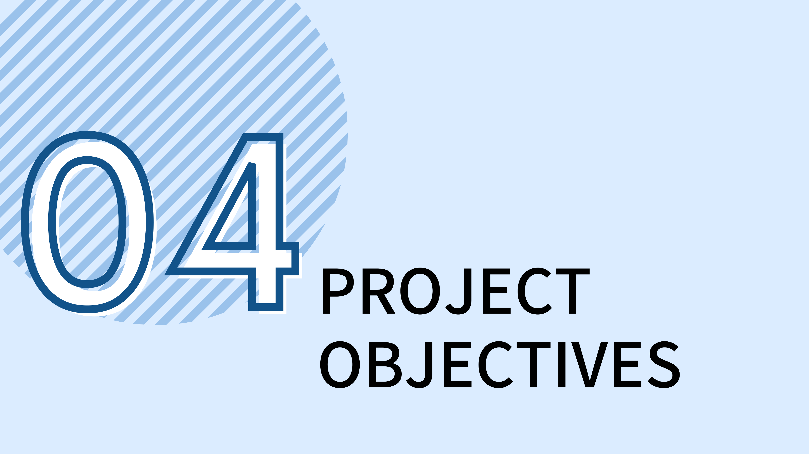

(Section divider)

---

## Slide 14 — Objectives

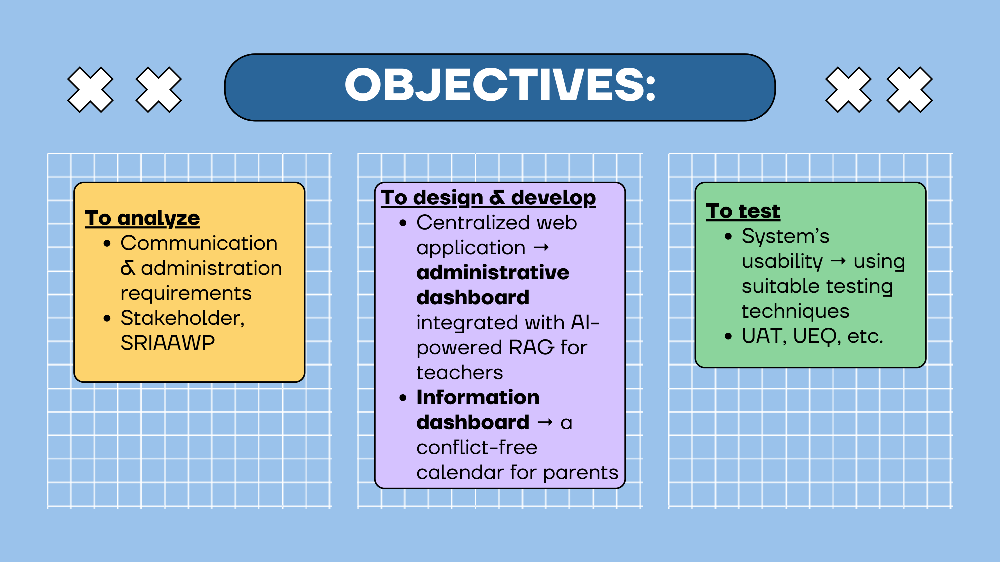

| # | Verb | Detail |
|---|---|---|
| 1 | **To analyze** | Communication & administration requirements; stakeholder is SRIAAWP. |
| 2 | **To design & develop** | A centralized web application: an **administrative dashboard** integrated with AI-powered RAG for teachers, and an **information dashboard** with a conflict-free calendar for parents. |
| 3 | **To test** | The system's usability using suitable testing techniques (UAT, UEQ, etc.). |

---

## Slide 15 — Section: 05 Project Scopes

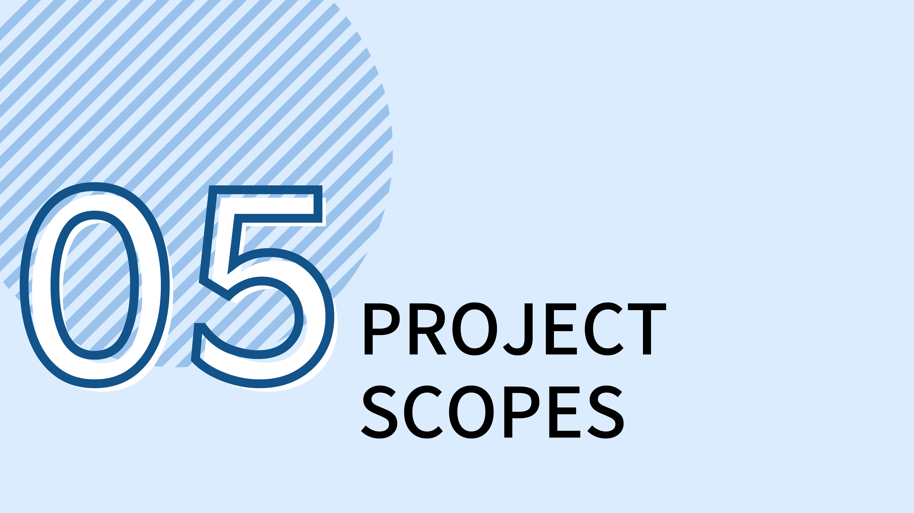

(Section divider)

---

## Slide 16 — Project Scopes

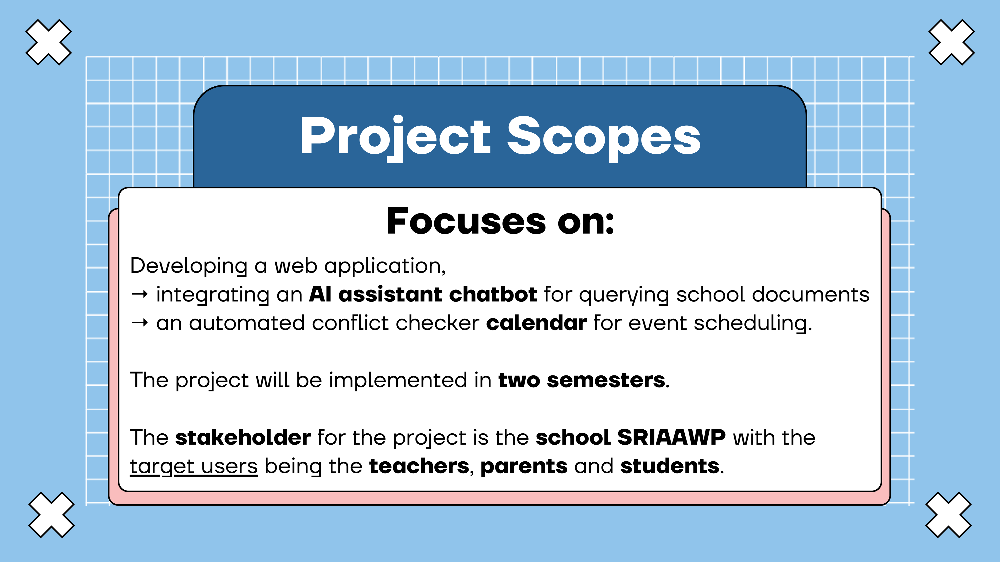

Focuses on developing a web application that:

- integrates an **AI assistant chatbot** for querying school documents
- includes an automated **conflict-checker calendar** for event scheduling

The project will be implemented in **two semesters**. The stakeholder is **SRIAAWP**, with target users being **teachers, parents, and students**.

---

## Slide 17 — Section: 06 Methodology & Tech Stack

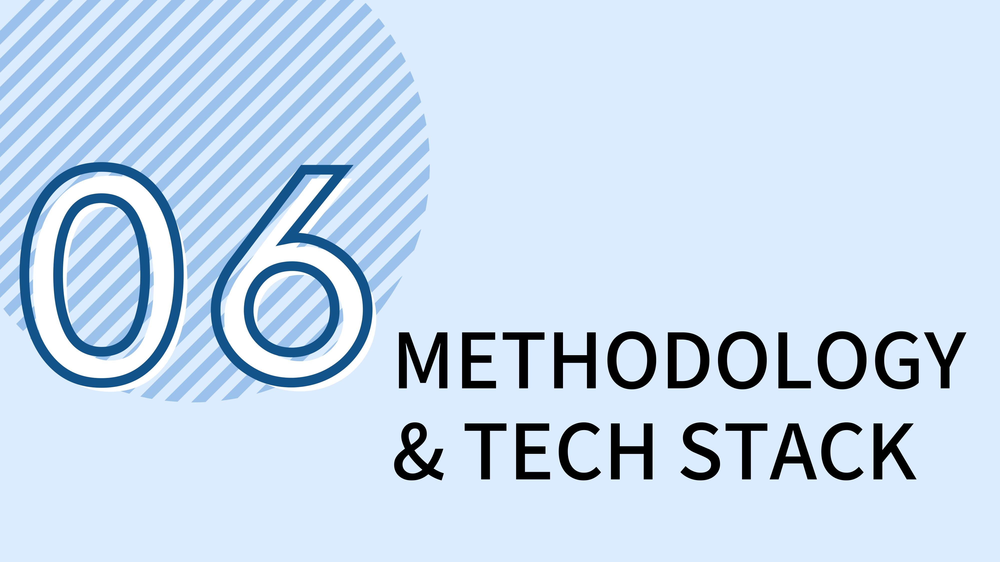

(Section divider)

---

## Slide 18 — Technologies

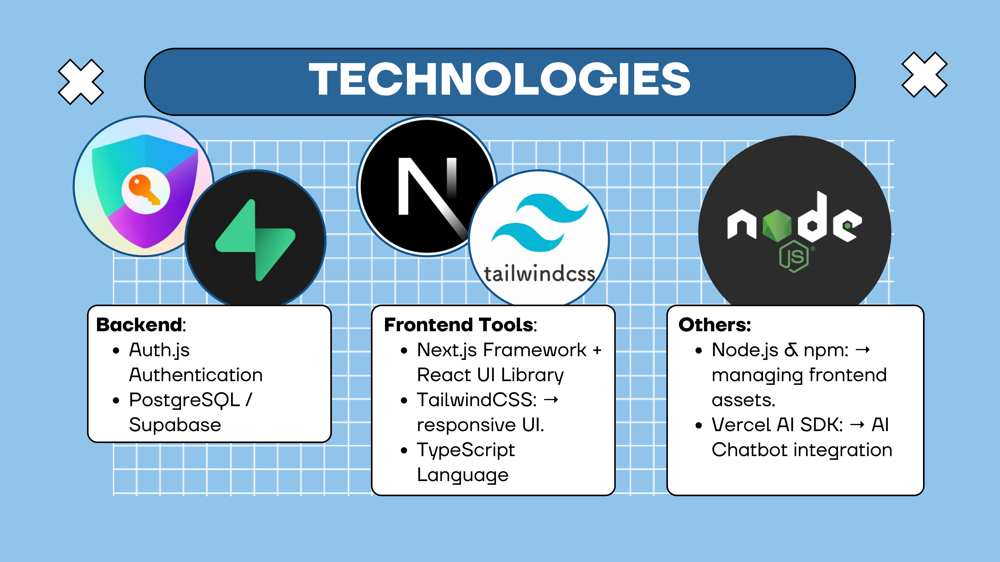

**Backend**

- Auth.js Authentication
- PostgreSQL / Supabase

**Frontend Tools**

- Next.js Framework + React UI Library
- TailwindCSS (responsive UI)
- TypeScript Language

**Others**

- Node.js & npm — managing frontend assets
- Vercel AI SDK — AI chatbot integration

---

## Slide 19 — Methodology Split

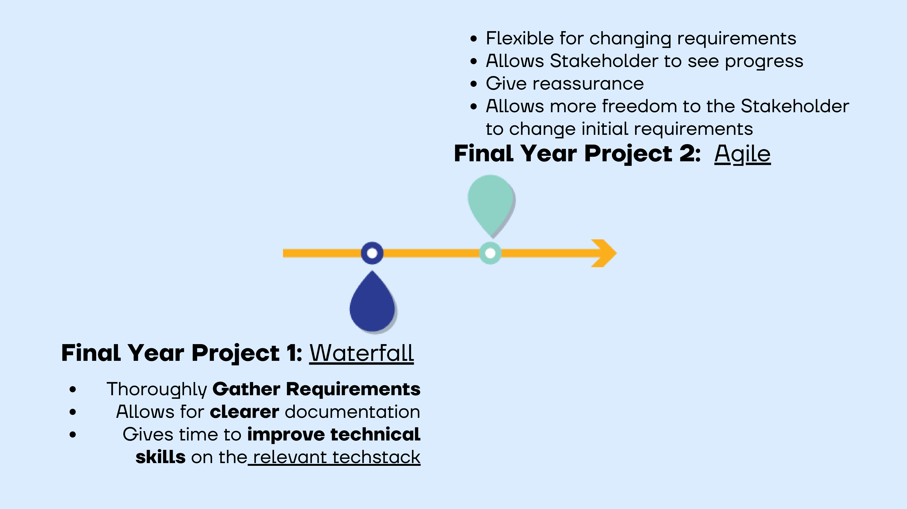

**Final Year Project 1: Waterfall**

- Thoroughly **gather requirements**
- Allows for **clearer documentation**
- Gives time to **improve technical skills** on the relevant tech stack

**Final Year Project 2: Agile**

- Flexible for changing requirements
- Allows stakeholder to see progress
- Gives reassurance
- Allows more freedom to the stakeholder to change initial requirements

---

## Slide 20 — Section: 07 NABC Analysis

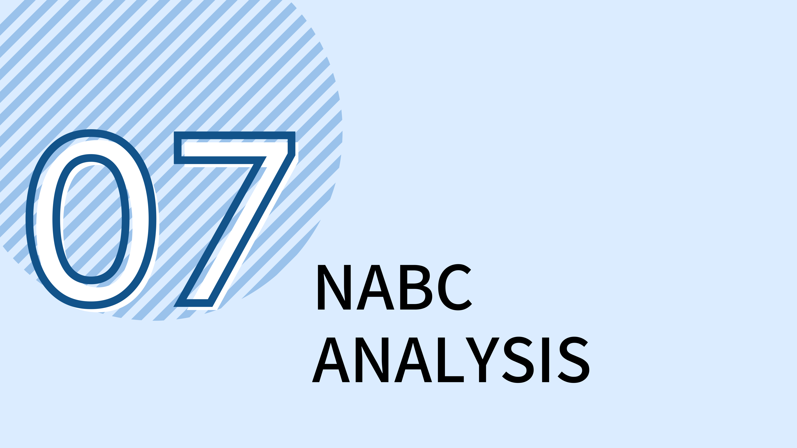

(Section divider)

---

## Slide 21 — Need

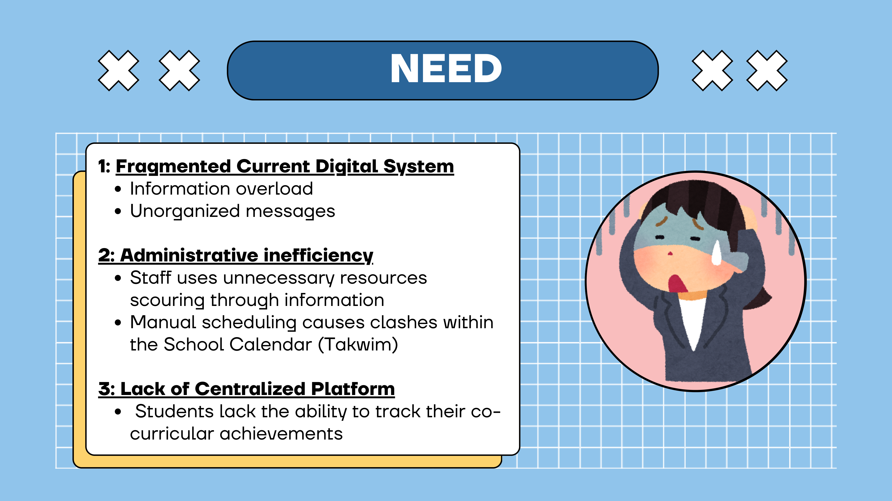

1. **Fragmented Current Digital System** — information overload, unorganized messages.
2. **Administrative Inefficiency** — staff use unnecessary resources scouring through information; manual scheduling causes clashes within the School Calendar (Takwim).
3. **Lack of Centralized Platform** — students lack the ability to track their co-curricular achievements.

---

## Slide 22 — Approach

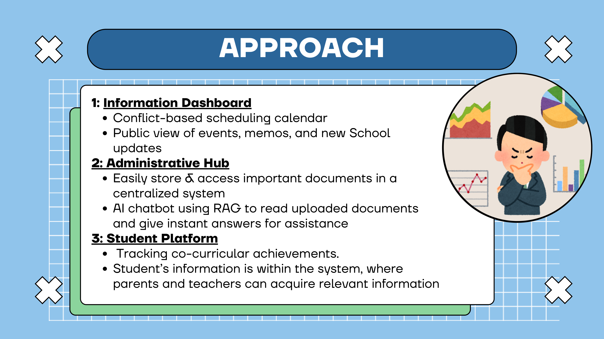

1. **Information Dashboard** — conflict-based scheduling calendar; public view of events, memos, and new school updates.
2. **Administrative Hub** — easily store & access important documents in a centralized system; AI chatbot using RAG to read uploaded documents and give instant answers for assistance.
3. **Student Platform** — tracking co-curricular achievements; student information held within the system, where parents and teachers can acquire relevant information.

---

## Slide 23 — Benefits

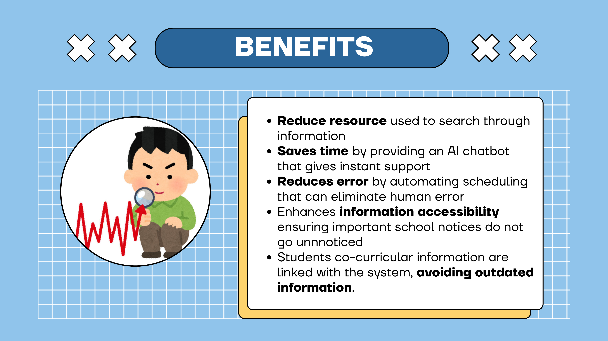

- **Reduce resource** used to search through information.
- **Saves time** by providing an AI chatbot that gives instant support.
- **Reduces error** by automating scheduling that can eliminate human error.
- Enhances **information accessibility**, ensuring important school notices do not go unnoticed.
- Students' co-curricular information are linked with the system, **avoiding outdated information**.

---

## Slide 24 — Competition

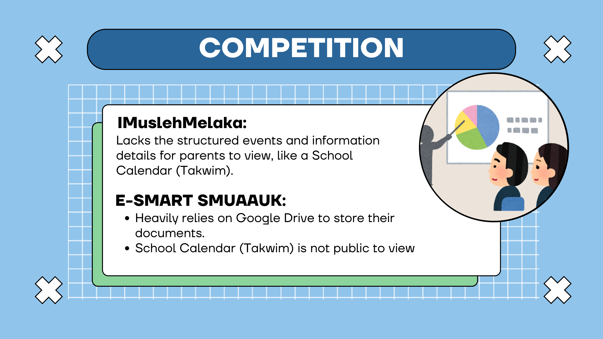

**IMuslehMelaka** — Lacks the structured events and information details for parents to view, like a School Calendar (Takwim).

**E-SMART SMUAAUK**

- Heavily relies on Google Drive to store their documents.
- School Calendar (Takwim) is not public to view.

---

## Slide 25 — Section: 08 Use Case Diagram

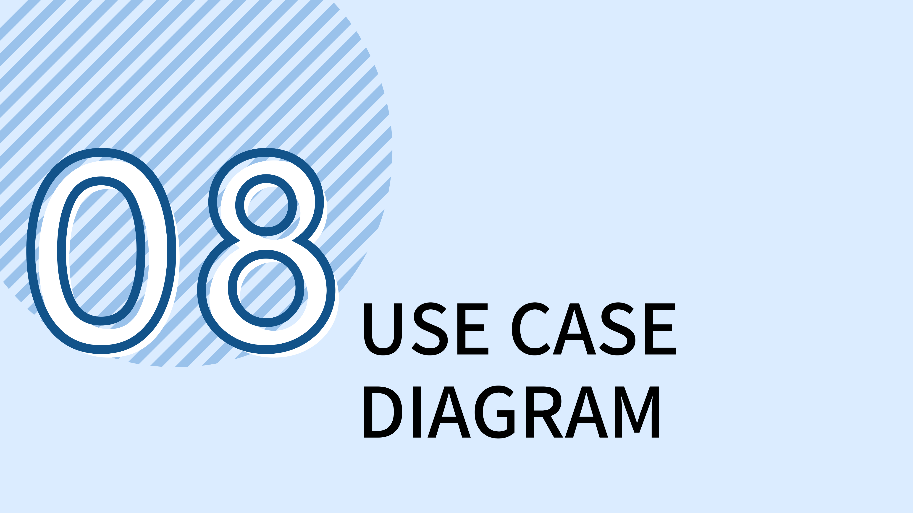

(Section divider)

---

## Slide 26 — Use Case Diagram

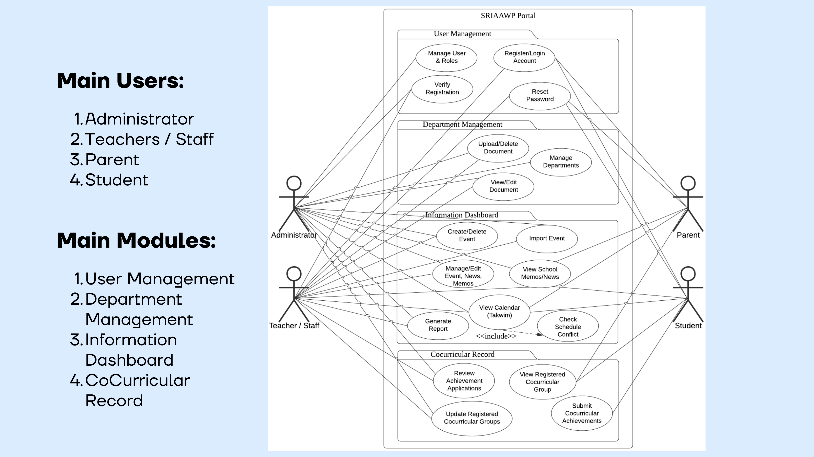

**Main Users**

1. Administrator
2. Teachers / Staff
3. Parent
4. Student

**Main Modules**

1. **User Management** — Manage User & Roles, Register/Login Account, Verify Registration, Reset Password.
2. **Department Management** — Upload/Delete Document, Manage Departments, View/Edit Document.
3. **Information Dashboard** — Create/Delete Event, Import Event, Manage/Edit Event-News-Memos, View School Memos/News, View Calendar (Takwim), Generate Report, Check Schedule Conflict (`<<include>>` from View Calendar).
4. **Co-curricular Record** — Review Achievement Applications, View Registered Co-curricular Group, Update Registered Co-curricular Groups, Submit Co-curricular Achievements.

Actor → use-case mapping (from the diagram):

| Actor | Notable use cases |
|---|---|
| Administrator | All four modules — full coverage incl. Manage User & Roles, Verify Registration, Manage Departments. |
| Teacher / Staff | Department docs (upload/edit), event/news/memo authoring, calendar + conflict check, generate report, review achievement applications, update registered co-curricular groups. |
| Parent | Register/login, view memos/news, view calendar, view registered co-curricular group. |
| Student | Register/login, view memos/news, view calendar, submit co-curricular achievements, view registered co-curricular group. |

---

## Slide 27 — Section: 09 References

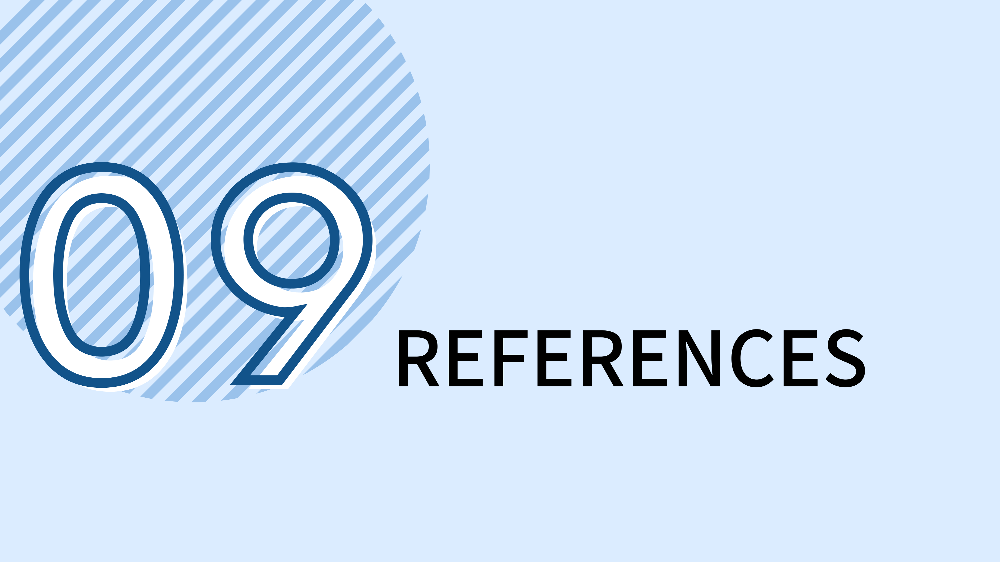

(Section divider)

---

## Slide 28 — References

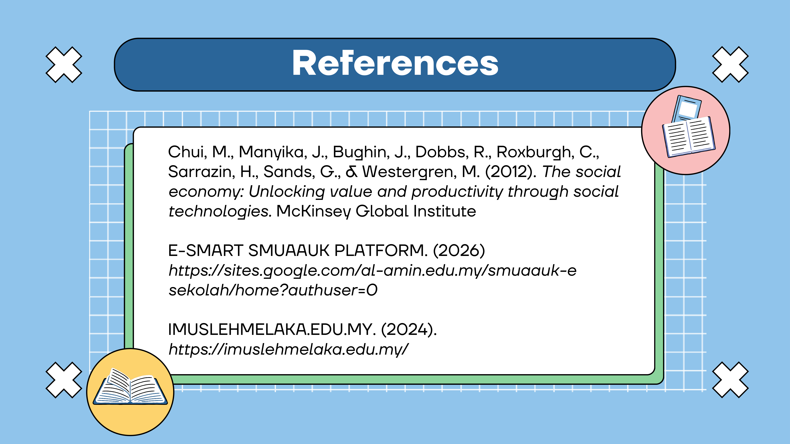

- Chui, M., Manyika, J., Bughin, J., Dobbs, R., Roxburgh, C., Sarrazin, H., Sands, G., & Westergren, M. (2012). *The social economy: Unlocking value and productivity through social technologies.* McKinsey Global Institute.
- E-SMART SMUAAUK PLATFORM. (2026). https://sites.google.com/al-amin.edu.my/smuaauk-e-sekolah/home?authuser=0
- IMUSLEHMELAKA.EDU.MY. (2024). https://imuslehmelaka.edu.my/

---

## Slide 29 — Section: 10 Appendix

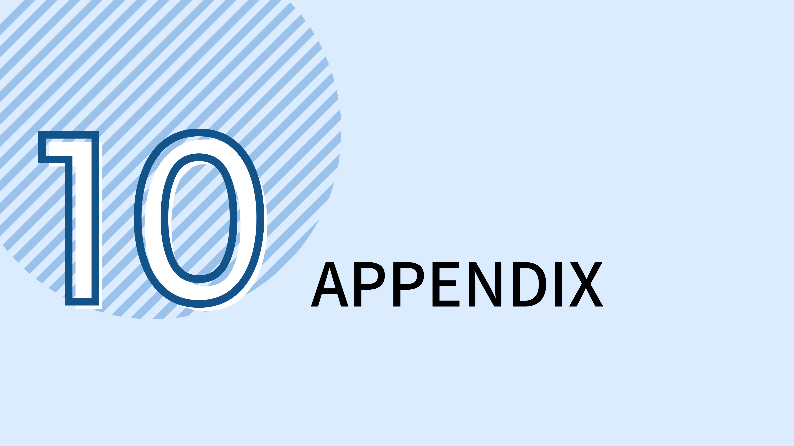

(Section divider)

---

## Slide 30 — Stakeholder Agreement

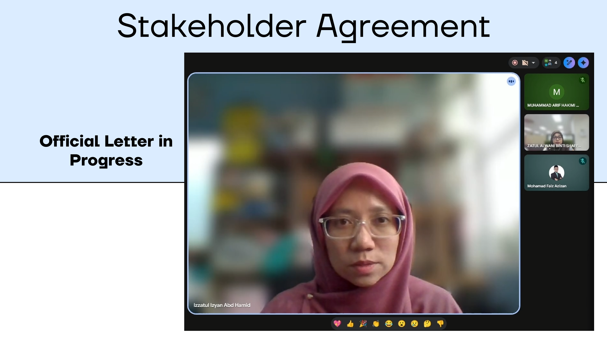

**Official Letter in Progress.**

Screenshot from a stakeholder meeting (Google Meet) showing participants: Muhammad Arif Hakimi, Zatul Alwani Binti Shaffiei, Mohamad Faiz Azizan, and Izzatul Izyan Abd Hamid.
